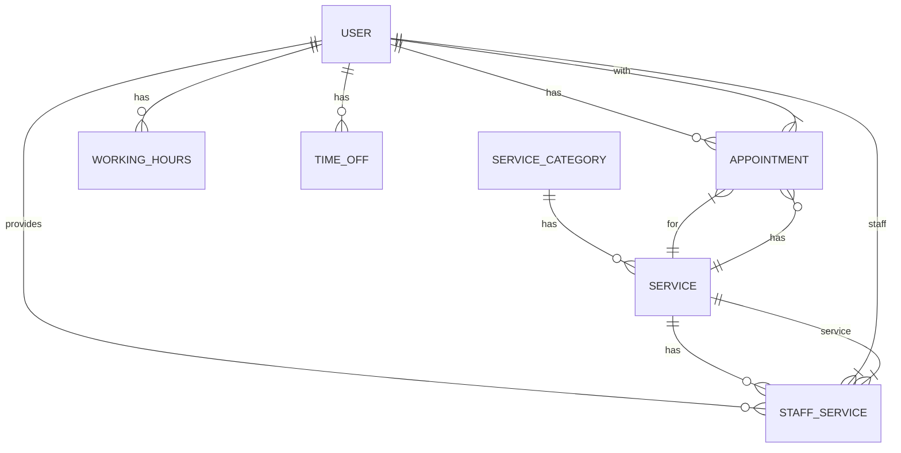

# Database Migrations

This document provides information about the database migrations in the salon management system.

## Available Scripts

### Running Migrations

To run all pending migrations:

```bash
npm run migrate
```

### Creating a New Migration

To create a new migration file:

```bash
npm run migrate:create <migration-name>
```

For example:

```bash
npm run migrate:create add-user-roles
```

This will create a new migration file in the `server/migrations` directory with a timestamp and the provided name.

### Undoing Migrations

To undo the most recent migration:

```bash
npm run migrate:undo
```

To undo all migrations:

```bash
npm run migrate:undo:all
```

### Checking Migration Status

To check the status of all migrations:

```bash
npm run migrate:status
```

## Working with Seeders

### Creating a New Seeder

To create a new seeder file:

```bash
npm run seed:create <seeder-name>
```

For example:

```bash
npm run seed:create demo-services
```

### Running All Seeders

To run all seeders:

```bash
npm run seed
```

### Undoing Seeders

To undo the most recent seeder:

```bash
npm run seed:undo
```

To undo all seeders:

```bash
npm run seed:undo:all
```

## Migration Naming Conventions

- Use descriptive names in kebab-case (e.g., `add-user-roles`, `create-appointments-table`)
- The timestamp will be automatically prefixed to the migration filename
- Migration files should be idempotent (can be run multiple times without side effects)

## Best Practices

1. Always test migrations in a development environment before running in production
2. Write down migrations to handle both `up` and `down` operations
3. Keep migrations small and focused on a single change
4. Never modify migrations that have already been run in production
5. Use transactions for data migrations to ensure consistency

## Troubleshooting

### Common Issues

1. **Connection Issues**: Ensure your database is running and the connection details in `.env` are correct
2. **Migration Locks**: If a migration fails, you might need to manually remove the lock from the `SequelizeMeta` table
3. **Syntax Errors**: Double-check your migration code for syntax errors before running

### Viewing Migration Logs

Migrations output logs to the console. For more detailed logging, you can enable SQL logging by setting `logging: console.log` in your database configuration.

## Production Considerations

- Always back up your database before running migrations in production
- Consider using a blue-green deployment strategy for zero-downtime migrations
- Test all migrations in a staging environment that mirrors production
- Monitor the migration process and have a rollback plan in place

## Database Schema

The following diagram shows the main tables and their relationships:



## Version Compatibility

This project uses:
- Node.js: ^16.0.0
- Sequelize: ^6.35.0
- Sequelize CLI: ^6.6.1

## License

This project is licensed under the ISC License - see the [LICENSE](LICENSE) file for details.
